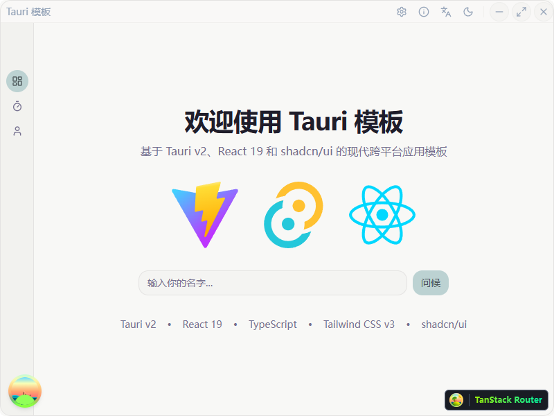
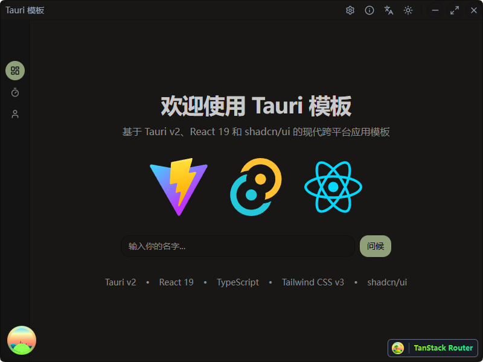
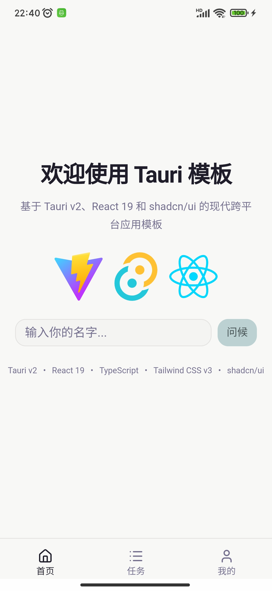
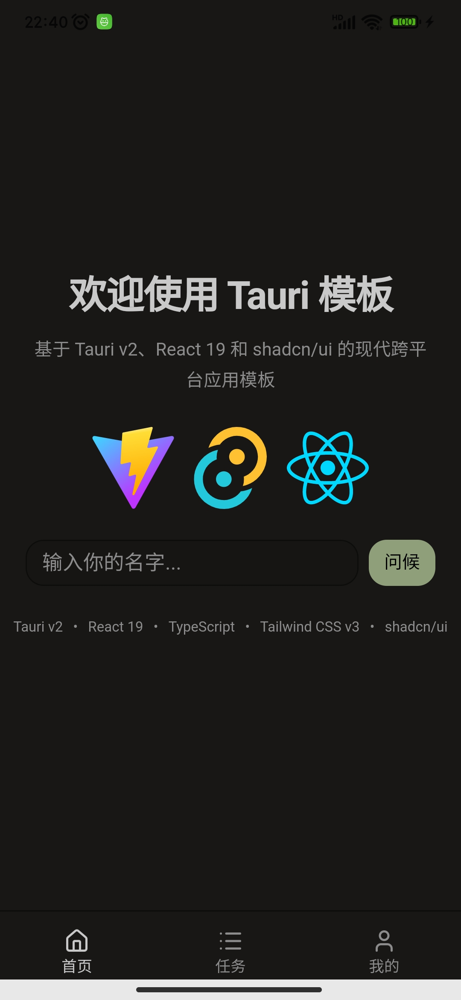

<div align="center">

# Tauri Template

English | [简体中文](./README.zh-CN.md)

[](https://tauri.app/)
[](https://react.dev/)
[](https://www.typescriptlang.org/)
[](./LICENSE)

A modern Tauri v2 template for Windows-first desktop apps and Android development, built with React 19, TypeScript, and shadcn/ui.

</div>

## Screenshots

### Desktop

| Light Mode | Dark Mode |
|---|---|
|  |  |

### Mobile

| Light Mode | Dark Mode |
|---|---|
|  |  |

## Features

### Core
- ⚡ **Modern Stack** — Tauri v2 + React 19 + TypeScript + Vite
- 📱 **Responsive App Shell** — Desktop sidebar / child windows, mobile bottom navigation, and safe-area-aware secondary pages
- 🎨 **Theming** — CSS variable themes (cupcake light / forest dark) with next-themes and auto system detection
- 🌐 **Internationalization** — i18next with English and Chinese translations
- 🪟 **Custom Titlebar** — Frameless window with drag support, per-window minimize/close configurable in settings

### Interaction
- 🗂️ **Multi-Window** — Child window creation, lifecycle management, lazy initialization with eager child windows
- 🔔 **System Tray** — Tray icon with menu (Show / Settings / Quit), localized labels via i18n
- ⌨️ **Global Shortcuts** — Register shortcuts that work even when the app is not focused
- 🔍 **Command Palette** — Ctrl+K quick search for opening windows, toggling theme, switching language
- 🛎️ **Native Notifications** — OS-level notifications via `tauri-plugin-notification`

### Architecture & Quality
- 📦 **State Management** — Zustand (persisted window behavior) + TanStack Query (server state with official opt-in persistence for stable queries)
- 🧩 **Modular Structure** — Feature-based layout (`features/`, `api/`, `stores/`)
- 🧪 **Testing** — Vitest + Testing Library
- 📊 **Bundle Analysis** — rollup-plugin-visualizer
- 🦀 **Production-Grade Rust Backend** — Modular structure (`commands/`, `error/`, `logging/`, `models/`, `plugins/`, `services/`), `thiserror` error types, `tracing` instrumentation, Cargo workspace mode
- 📝 **Structured Logging** — `tracing-subscriber` with `EnvFilter`, console output

### DevOps
- 🔄 **Release Automation** — GitHub Actions verifies every tagged release, packages Windows updater artifacts, and keeps desktop build lanes warm for macOS/Linux
- 🔧 **Build Script** — `build.ps1` for multi-platform (Windows dev/build, Android dev/build, clean)
- 🤖 **Android Project Bootstrap** — Regenerate `src-tauri/gen/android` with `pnpm tauri android init` when the generated Android project is removed or invalid
- 🏷️ **Version Management** — Interactive or CLI-driven release workflow with lint/build/changelog gates

## Platform Scope

- Windows desktop: productized template path with NSIS packaging and updater artifacts.
- macOS / Linux desktop: build-verified in CI, but signing, notarization, and downstream distribution remain app-specific follow-up work.
- Android: supported for local development and APK generation.
- iOS: configuration scaffolding exists, but this template does not include a productized local or CI packaging flow yet.

See [Support Matrix](./docs/SUPPORT_MATRIX.md) for the current target status.

## Tech Stack

- **Desktop Framework**: [Tauri v2](https://tauri.app/)
- **Frontend Framework**: [React 19](https://react.dev/) + [TypeScript](https://www.typescriptlang.org/)
- **Build Tool**: [Vite](https://vite.dev/)
- **UI Components**: [shadcn/ui](https://ui.shadcn.com/)
- **Styling**: [Tailwind CSS v3](https://tailwindcss.com/)
- **State Management**: [Zustand](https://github.com/pmndrs/zustand) + [TanStack Query](https://tanstack.com/query) with `PersistQueryClientProvider`
- **Routing**: [TanStack Router](https://tanstack.com/router)
- **Icons**: [Lucide](https://lucide.dev/)
- **Internationalization**: [i18next](https://www.i18next.com/)
- **Theming**: [next-themes](https://github.com/pacocoursey/next-themes)
- **Form Validation**: [Zod](https://zod.dev/)
- **Command Palette**: [cmdk](https://cmdk.paco.me/)
- **Animation**: [motion](https://motion.dev/)
- **Notifications**: [sonner](https://sonner.emilkowal.ski/) (toast) + `tauri-plugin-notification` (native)
- **Logging**: [tracing](https://docs.rs/tracing/) + `tracing-subscriber`
- **Code Quality**: [ESLint (antfu/eslint-config)](https://github.com/antfu/eslint-config)

## Quick Start

### Prerequisites

| Tool | Minimum Version |
|------|----------------|
| Node.js | 25 |
| pnpm | 10 |
| Rust | 1.92 |

### Setup

```bash
pnpm install
```

### Development

```bash
pnpm tauri dev
```

Launches the app with hot-reload. Use `pnpm dev` for the frontend-only Vite dev server at `http://localhost:1420`.

### Production Build

```bash
pnpm tauri build
```

Compiles the Rust backend and bundles the frontend into platform-specific installers.

### Android

```bash
pnpm tauri android init
pnpm build:android:debug
```

Use `pnpm tauri android init` once before the first Android build, or anytime `src-tauri/gen/android` has been deleted or needs to be regenerated. The PowerShell build script also auto-initializes Android when the generated project is completely missing.

## Scripts

| Command | Description |
|---------|-------------|
| `pnpm dev` | Frontend Vite dev server |
| `pnpm build` | TypeScript check + Vite production build |
| `pnpm lint` | Run linter |
| `pnpm lint:fix` | Lint and auto-fix |
| `pnpm test` | Run tests (Vitest) |
| `pnpm test:watch` | Watch mode |
| `pnpm coverage` | Test coverage report |
| `pnpm analyze` | Bundle size analysis |
| `pnpm changelog` | Generate CHANGELOG.md from conventional commits |
| `pnpm release:version` | Version release workflow (see below) |
| `pnpm check:all` | Run lint, Vitest, frontend build, and Rust tests together |
| `pnpm build:win` | Windows Tauri build via `build.ps1` |
| `pnpm build:android` | Android Tauri build via `build.ps1` |
| `pnpm build:android:debug` | Android debug APK via `build.ps1` |
| `pnpm build:clean` | Clean build artifacts via `build.ps1` |

## Version Management

`pnpm release:version` drives the full release workflow:

```bash
pnpm release:version              # Interactive (English)
pnpm release:version --lang zh    # Interactive (Chinese)
pnpm release:version 0.1.0        # Non-interactive, direct version
pnpm release:version 0.1.0 --dry-run  # Preview only
```

**CLI flags:**

| Flag | Description |
|------|-------------|
| `--dry-run` | Print what would happen, don't execute |
| `--no-push` | Commit and tag locally, skip push |
| `--no-lint` | Skip lint gate |
| `--no-build` | Skip build gate |
| `--no-changelog` | Skip changelog generation |
| `--lang zh\|en` | Force language (auto-detected from env) |

**Preflight checks:**

- Clean working tree, branch is `main`
- Version files in sync: `package.json`, `tauri.conf.json`, `Cargo.toml`, `Cargo.lock`
- Target tag does not exist locally or on `origin`

**Gates (run before file modification):**

- `pnpm run lint` — lint check (skippable)
- `pnpm run build` — frontend build check (skippable)

**Actions:**

- Generates CHANGELOG.md section from conventional commits
- Updates version in `package.json`, `tauri.conf.json`, `Cargo.toml`, `Cargo.lock`
- Creates release commit and `vX.Y.Z` tag
- Optionally pushes branch and tag

## Project Structure

```
.
├── src/                    # Frontend source code
│   ├── app/               # App composition (mounting, router, providers, shell)
│   ├── assets/            # Static assets (icons, logos)
│   ├── api/               # Tauri command wrappers (typed service functions)
│   ├── components/        # Shared React components (ui primitives, toaster, error boundary)
│   │   └── ui/           # shadcn/ui components
│   ├── features/          # Feature modules
│   │   ├── about/         # About page / child window
│   │   ├── command-palette/# Ctrl+K command palette
│   │   ├── home/          # Main dashboard, desktop shell switching
│   │   ├── profile/       # Mobile profile page and entry points for settings/about
│   │   ├── settings/      # Settings page / child window (theme, language, window behavior, shortcuts)
│   │   ├── tasks/         # Background task demo
│   │   └── updater/       # Update detection and install UX
│   ├── hooks/             # Shared custom hooks
│   ├── i18n/              # Internationalization
│   │   └── locales/       # Translation files (en, zh)
│   ├── lib/               # Utility functions and constants
│   ├── platform/          # Runtime / Tauri / desktop-window platform helpers
│   ├── providers/         # Cross-cutting context adapters (theme, query persistence)
│   ├── routes/            # TanStack Router route definitions + route metadata registry
│   ├── stores/            # Zustand stores
│   └── test/              # Test setup and test files
├── src-tauri/             # Tauri/Rust backend
│   ├── src/
│   │   ├── main.rs        # Entry point
│   │   ├── lib.rs         # App setup, plugin init, command registration
│   │   ├── app.rs + app/              # App bootstrap, config, shared state
│   │   ├── commands.rs + commands/  # Tauri commands (greet, task, notification, config, tray)
│   │   ├── config.rs                # Legacy config exports
│   │   ├── error.rs + error/        # Custom error types (thiserror, serde)
│   │   ├── logging.rs + logging/    # Tracing subscriber with EnvFilter
│   │   ├── models.rs + models/      # Serde structs (task progress, etc.)
│   │   ├── platform.rs + platform/  # Desktop platform integrations (tray, window rules)
│   │   ├── plugins.rs + plugins/    # Plugin wrappers
│   │   ├── response.rs              # API response helpers
│   │   ├── services.rs + services/  # Service layer
│   │   └── state.rs                 # Legacy state exports
│   ├── crates/             # Shared Cargo workspace crates
│   ├── capabilities/      # Tauri permission capabilities
│   └── tauri.conf.json    # Tauri configuration
├── scripts/               # Build & release scripts
│   ├── changelog.mjs      # Generate CHANGELOG from git log
│   ├── generate-feature.mjs  # Scaffold a new feature module
│   └── release-version.mjs  # Version bump, changelog, commit, tag, push
├── build.ps1              # Multi-platform build script (Windows, Android, clean)
├── docs/                  # Documentation
│   ├── AUTO_UPDATE.md     # Auto update guide
│   ├── I18N.md            # Internationalization guide
│   └── GLOBAL_SHORTCUT.md # Global shortcut guide
├── components.json        # shadcn/ui configuration
└── package.json
```

## Architecture Rules

- Route semantics and window metadata live in `src/routes/registry/`
- Router composition lives in `src/app/router.tsx` and `src/routes/builders/`
- Shell UI lives in `src/app/shell/`
- Platform/runtime code lives in `src/platform/`
- Rust module roots use `app.rs`, `platform.rs`, and `services.rs`, not `mod.rs`

## Query Persistence

- Stable read-only queries can opt into official TanStack persistence by setting `meta.persist = true`
- Persistence is wired through `src/app/providers/query-persistence.ts` with `PersistQueryClientProvider`
- Only opted-in queries are dehydrated and restored
- The persisted cache buster follows the app version via `VITE_APP_VERSION`, so a new release invalidates incompatible cached query data automatically

## CI/CD

GitHub Actions handles automated builds and publishing.

### Release Workflow

Push a tag matching `v*` (e.g. `v0.1.0`) to trigger a release build. The recommended approach is running `pnpm release:version`, which creates the tag automatically.

Alternatively, push a tag manually:

```bash
git tag v0.1.0
git push origin v0.1.0
```

### Build Artifacts

The current release workflow is productized for Windows updater distribution:

- **NSIS Installer** — Windows `.exe` setup package
- `latest.json` — update manifest for the built-in auto-updater

macOS and Linux remain build-verified lanes rather than fully documented distribution targets in this template.

### Auto-Update

To support automatic updates:

1. Generate a signing key pair: `pnpm tauri signer generate -w ~/.tauri/myapp.key`
2. Add `TAURI_SIGNING_PRIVATE_KEY` and `TAURI_SIGNING_PRIVATE_KEY_PASSWORD` to GitHub repository secrets

> During release, GitHub Actions replaces the placeholder public key and endpoint in `src-tauri/tauri.conf.json` with real values. The auto-updater reads `latest.json` from the latest GitHub Release assets.

See [Auto Update Configuration](./docs/AUTO_UPDATE.md) for full details.

### Code Signing (Optional)

Add these secrets to sign the Windows installer:

- `TAURI_SIGNING_PRIVATE_KEY` — the private key content
- `TAURI_SIGNING_PRIVATE_KEY_PASSWORD` — the private key password

The build still succeeds without them, but the installer will be unsigned.

### Multi-Platform

Windows is the primary packaged desktop target. macOS and Linux desktop builds stay enabled in CI to catch regressions, but production distribution steps are intentionally left to downstream apps. Android is supported through local Tauri mobile tooling and `build.ps1`. iOS remains a manual follow-up integration.

## Recommended IDE Setup

- [VS Code](https://code.visualstudio.com/)
- [Tauri](https://marketplace.visualstudio.com/items?itemName=tauri-apps.tauri-vscode)
- [rust-analyzer](https://marketplace.visualstudio.com/items?itemName=rust-lang.rust-analyzer)

## License

MIT
